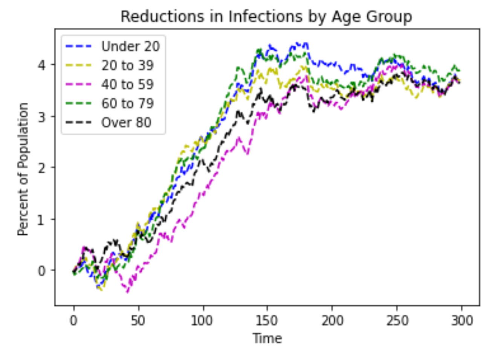
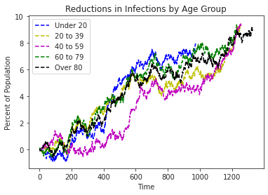
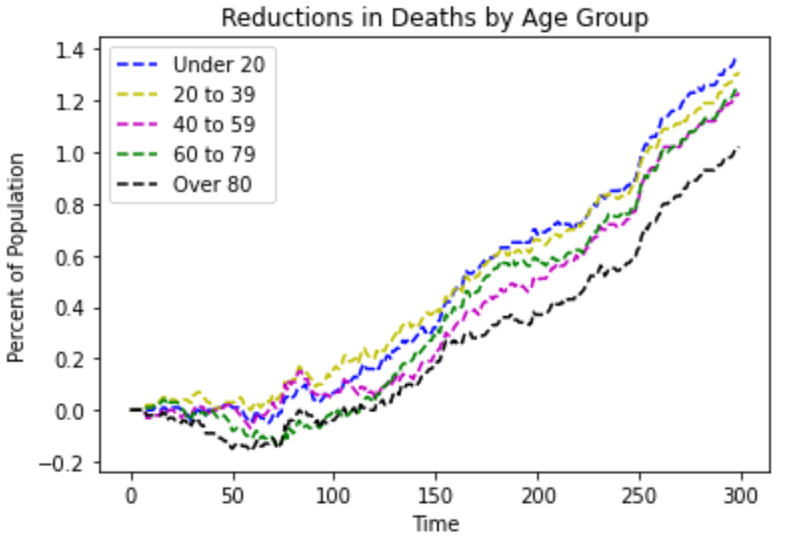
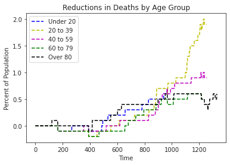

# Modelling and Simulation of COVID-19 Vaccine Prioritization by Age Groups

The COVID-19 pandemic has caused a major crisis worldwide, with case transmissions between individuals still occurring on a wide scale. 
In an effort to decrease the case transmissions in the long term, COVID-19 vaccines are urgently required to be distributed to the population. 
However, a limited quantity of the COVID-19 vaccines is available to be administered. 
This raises concerns on how to prioritize the COVID-19 vaccine doses among the population. 
The goal of this project is to apply the Cellular Automata Model and the SEIR Model to achieve a well motivated and data-driven decision on which age group to prioritize in the vaccine distribution plan with the goal of slowing down infection and death rates to protect the general population from the effects of the COVID-19 virus. 
The first part of this project analyzes COVID-19 vaccination prioritization using the Cellular Automata Model. In the CA model, we aim to display the spread of the COVID-19 virus simultaneously with the active distribution of the COVID-19 vaccine to each of the age groups under consideration. The second part of this project analyzes COVID-19 vaccination prioritization using the SEIR Model {Susceptible, Exposed, Infective, Recovered} by considering the following: (1) cumulative incidence, (2) mortality, and (3) years of life lost for each age group. Using both our models, we discuss the effectiveness of prioritizing each age group according to reductions in deaths and infections.

## Contents

1. Modelling_and_Simulation_of_COVID_19_Vaccine_Prioritization_by_Age_Groups.pdf - a full PDF report of the project which includes the following:
    1. Cellular Automata Model Simulation Tutorial
    2. SEIR Model Simulation Tutorial
    3. Model Verification and Validation
    4. Conclusion: The Prioritized Age Group
    5. Literature Review
2. Vaccine_Prioritization_CA.ipynb - a python jupyter notebook containing the Cellular Automata model simulation
3. Vaccine_Prioritization_SEIR.ipynb - a python jupyter notebook containing the SEIR model simulation

## Model Results: The Prioritized Age Group

***Which age group should be prioritized in the vaccine distribution?***

Given that there is only a limited quantity of the COVID-19 vaccines available, the goal of the project was to create a simulation in order to arrive at a well-motivated and data-driven decision on which age group to prioritize in the vaccine distribution plan with the goal of slowing down infections and decreasing death rates.
Both models provided very rich and data-driven results that simulate the different scenarios of prioritizing one of the five age groups. In order to arrive at an answer to our question, we need to evaluate each of the two goals we had.

### Slowing down infections
As compared to the baseline of no vaccinations, both models came to the conclusion that the introduction and administration of vaccines decreased the daily infections in the system. 
The following figures show the reduction in infections by prioritizing each of the age groups in both the CA and SEIR models.

<table>
  <tr>
    <td valign="top"></td>
    <td valign="top"></td>
  </tr>
  <tr>
    <td>Cellular Automata Model</td>
     <td>SEIR Model</td>
  </tr>
 </table>

The results produced by both models are very close. The first striking observation to notice is that both models conclude that prioritizing the 40-59 years age group consistently produces the lowest reductions in infections. 
This can be seen by the data line of the age group being the lowest in both models. 
In both models, the under 20 and 60-79 years age group data lines are the highest and produce the largest reductions in infections consistently. 
Using this observation, it suffices to say that the under 20 and 60-79 years age groups should be prioritized given that our goal is to slow down infections.

### Decreasing death rates
Consistent with the previous observations, it can as well be seen that both models conclude that the vaccinated scenarios produce a higher reduction in deaths than that of a non-vaccinated scenario. 
The following figures show the reduction in deaths by prioritizing each of the age groups in both the CA and SEIR models.

<table>
  <tr>
    <td valign="top"></td>
    <td valign="top"></td>
  </tr>
  <tr>
    <td>Cellular Automata Model</td>
     <td>SEIR Model</td>
  </tr>
 </table>

Once again, the results produced by both models are very close. The first striking observation to notice is that both models agree that prioritizing the over 80 age group consistently produces the lowest reductions in deaths. This can be seen in the figure through the data line of the age group being the lowest in both models. In the CA model, the under 20 age group produces the largest reduction in deaths, closely followed by the 20-39 age group. Similarly, in the SEIR model, the 20-39 age group produces the largest reduction in deaths. Due to the variation in results from both models, our finalized result should as well include a bias from the age group chosen to prioritize in the first goal.

Overall, to slow down infections it is important to prioritize the under 20 or 60-79 years age groups, while to decrease death rates it is important to prioritize the under 20 or 20-39 age groups. Bringing both results together, we are able to make a robust decision. Considering that prioritizing the under 20 age group in the vaccine distribution consistently produced far better results as compared to the other age groups, it is apparent that they are the age group to be chosen in order to meet both goals of the project. 

**Therefore, using the results from both the CA and SEIR models, our well-motivated and data-driven decision is to prioritize the Under 20 age group in the vaccine distribution with the goal of slowing down infections and decreasing death rates.**

---

Open the PDF to view the full report of the project along with a tutorial of each simulation model.
